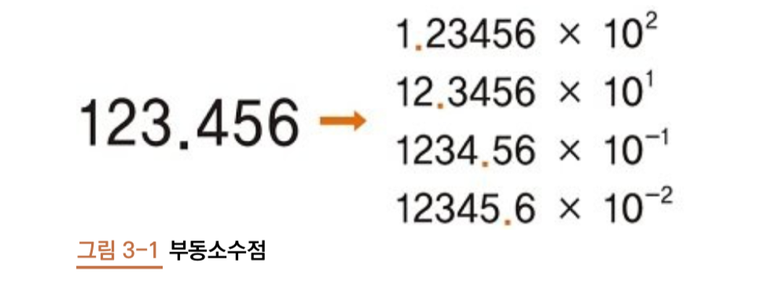
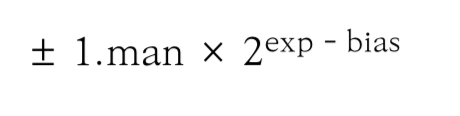

# 3장. 실수

## 1. 실수 연산의 함정 (intro)

```python

    a = 0.01
    result = 0.0
    for i in range(100):
        result += a
    
    result
```

``` 
1.0000000000000000000007
```
- 우리가 기대하는 값(1)과는 다른 값 출력.


## 2. 부동소수점


- `단정도 (single - precision)` 부동소수점
    - 실수를 32비트(4바이트)로 표현.
    - 부호 1비트, 지수부 8비트, 가수부 23비트로 구성.
    
    
- `배정도 (double - precision)` 부동소수점
    - 실수를 64비트(8바이트)로 표현.
    - 부호 1비트, 지수부 11비트, 가수부 52비트로 구성.
    - 단정도보다 두 배 많은 만큼 정밀도도 높음.
    - 파이썬은 배정도를 이용하여 실수를 표현.
    
## 3. 1바이트 실수 자료형 설계하기 



- 1.man은 가수, 2는 밑수, exp-bias 지수를 의미.
- `정규화 (normalization)` 란 소수점 왼쪽에 위치한 가수 부분을 밑수보다 작은 자연수가 되도록 만드는 것. 
- 메모리 구조 

        
    - 1바이트의 메모리 구조를 정하고 man과 exp값만 저장하면 설계가 끝남. 
    - bias는 지수의 부호를 결정하는 데 사용. bias는 $2^(n-1)-1$
    - 지수부와 가수부에 할당하는 비트 수에 따라 `표현 범위`와 `정밀도`가 결정됨. 
    
- (ex) 7.75 1바이트의 실수 자료형 설계하기
#### 1) 10진수 실수를 2진수 실수로 바꾸기 
        
        7.75 = 4 + 2 + 1 + 0.5 + 0.25 
                = $2^2 + 2^1 + 2^0 + 2^(-1) + 2^(-2) $
                = 111.11
#### 2) 정규화
   
        111.11 = 1.1111 * $2^2$ 
#### 3) 메모리 구조

        - 부호 : 0
        - 지수부 : 1001
        - 가수부 : 1111 -> 111 (가수부는 3비트만 할당되기 때문에 뒷자리 1 생략) 
#### 4) 결과 

        0 1001 111 = 0100 1111 = 0x4f
#### 5) 한계

        가수부 맨 뒷자리 1을 누락했기 때문에 7.75가 아닌 7.5로 표현됨. 0.25만큼 차이가 나기 때문에 정밀도가 떨어짐.
        
        
## 4. 엡실론과 정밀도 
- `엡실론(epsilon)`이란 실수자료형에서 1.0과 그 다음으로 표현 가능한 수 사이의 차이. 
- 엡실론보다 작은 값을 더하는 것은 부동 소수점 방식에서 표현 불가. (즉, 두 수의 차이를 인식하지 못함)
- 엡실론보다 작은 값의 차이를 표현할 수 없으므로 정밀도가 떨어짐
```python
import sys
sys.float_info.epsilon
```

```
2.220446049250313e-16
```
